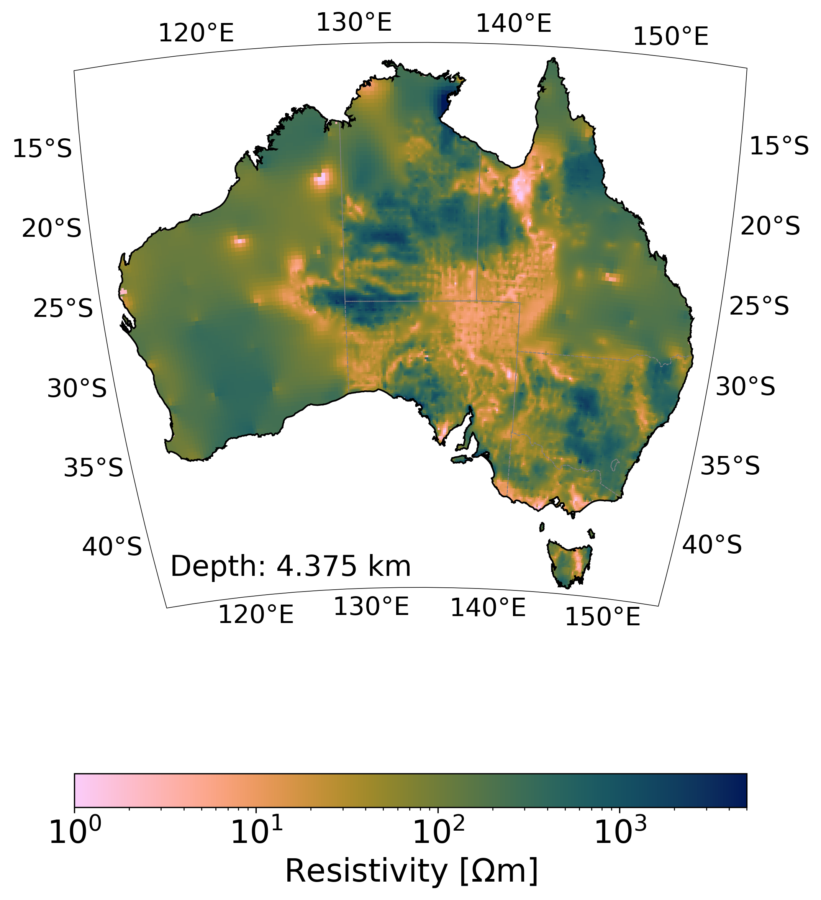
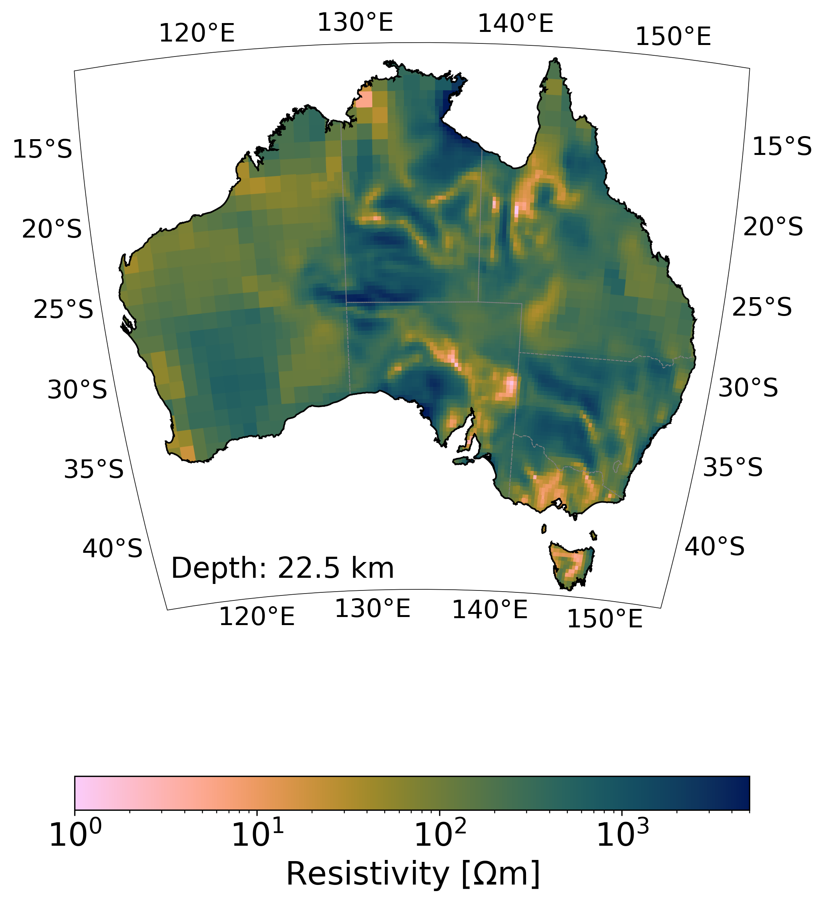
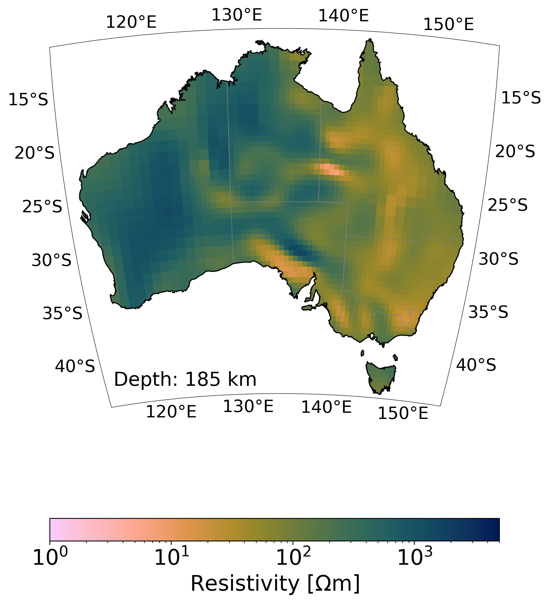

# MECMAUS

Multi-scale Electrical Conductivity Model of Australia (MECMAUS). The Jupyter notebook can be used to read in and plot models.

There are now two versions of the MECMUS model:
- The MECMAUS-2025 is the newest version of the model, derived from nearly 1400 AusLAMP MT stations and 60 legacy and modern geomagnetic stations, whereby both impedance tensor and induction vectors (tippers) were inverted in 3-D using the GoFEM inverse solver [[1](https://doi.org/10.1093/gji/ggz030), [2](https://doi.org/10.1093/gji/ggv165)]. 

# References
- Grayver, A., Duan, J., Thiel, S., Munch, F., Heinson, G. (2025). The electrical conductivity model of the Australian lithosphere, in preparation

# License

This repository and the MECMAUS model are licensed under the [Creative Commons Attribution 4.0 International License (CC BY 4.0)](https://creativecommons.org/licenses/by/4.0/).

